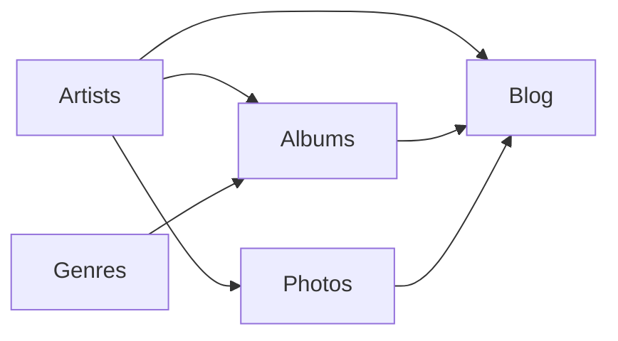

# Memory Bank - The Yelling Light

Diese Memory Bank enthält umfassende Dokumentation für das "The Yelling Light" Projekt - eine Nuxt.js-basierte Website für ein Schweizer Musiklabel.

## 📁 Dokumentationsstruktur

### [📋 Projekt-Übersicht](./project-overview.md)
Grundlegende Informationen über das Projekt, Ziele, Zielgruppe und Kernfunktionen.

### [🏗️ Technische Architektur](./technical-architecture.md)
Detaillierte technische Dokumentation des Framework-Stacks, Komponenten-Architektur und Performance-Optimierungen.

### [📝 Content-Struktur](./content-structure.md)
**SCHWERPUNKT**: Umfassende Dokumentation der Netlify CMS Konfiguration, Content-Workflows und Content-Management-Richtlinien.

### [⚙️ Entwicklungsrichtlinien](./development-guidelines.md)
Code-Standards, Komponenten-Entwicklung, Testing-Guidelines und Best Practices.

### [🚀 Deployment & Hosting](./deployment.md)
Netlify-Konfiguration, Build-Pipeline, Performance-Monitoring und Deployment-Workflows.

### [🔧 Troubleshooting](./troubleshooting.md)
Häufige Probleme und Lösungen, einschließlich Vue-Versionskonflikte, Build-Probleme und Deployment-Issues.

### [🚀 Nuxt 3 Migration Analyse](./nuxt3-migration-analysis.md)
Detaillierte Analyse für ein mögliches Upgrade von Nuxt 2 auf Nuxt 3, einschließlich Aufwand, Kosten-Nutzen und Empfehlungen.

## 🎯 Projekt-Kontext

**The Yelling Light** ist ein Schweizer Musiklabel mit einer modernen, JAMstack-basierten Website, die folgende Hauptbereiche abdeckt:

- **Künstler-Management**: Profile, Biografien, Social Media Integration
- **Album-Katalog**: Releases mit Streaming-Integration (Spotify, YouTube)
- **Blog-System**: News und Updates über Künstler und Releases
- **Fotografie**: Professionelle Konzert- und Künstlerfotos
- **Content Management**: Netlify CMS für einfache Inhaltsverwaltung

## 🛠️ Technologie-Stack

- **Frontend**: Nuxt.js 2.14.5 (Vue.js)
- **Styling**: Tailwind CSS 3.0.2
- **Content**: @nuxt/content + Netlify CMS
- **Hosting**: Netlify (statische Generierung)
- **Animationen**: GSAP 3.6.0
- **Performance**: Vue-Lazyload, Bundle-Optimierung

## 📊 Content-Management-Fokus

Diese Memory Bank legt besonderen Schwerpunkt auf Content-Management-Workflows:

### Netlify CMS Collections
- **Artists**: Künstlerprofile mit umfangreichen Metadaten
- **Albums**: Album-Informationen mit Genre-Relationen
- **Blog**: News-Posts mit Artist/Album-Verknüpfungen
- **Photos**: Galerie-System mit Multi-Artist-Support
- **Genres**: Taxonomie für Musikrichtungen
- **Team**: Team-Mitglieder-Profile

### Content-Relationen

### Workflow-Integration
- Git-basierte Versionskontrolle
- Editorial Workflow mit Preview-Branches
- Automatische Build-Trigger bei Content-Änderungen
- Social Media Integration (Spotify, YouTube, etc.)

## 🔄 Letzte Aktualisierung

**Datum**: 12. August 2025  
**Version**: 1.0  
**Status**: Vollständig dokumentiert

## 📞 Kontakt & Support

Für Fragen zur Dokumentation oder zum Projekt wenden Sie sich an das Entwicklungsteam.

---

*Diese Memory Bank wurde erstellt, um eine umfassende Wissensbasis für das The Yelling Light Projekt zu schaffen und die Einarbeitung neuer Entwickler zu erleichtern.*