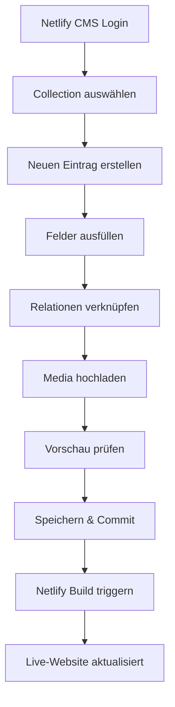
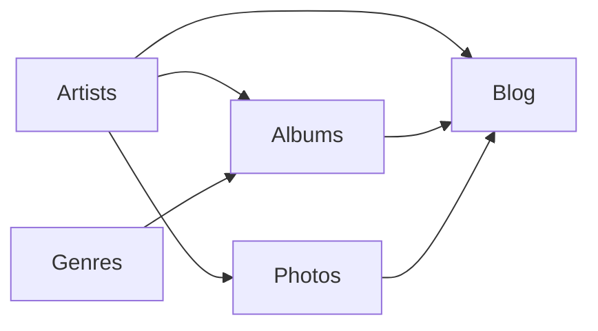

# Content-Management-Struktur - The Yelling Light

## Netlify CMS Konfiguration

### Backend-Konfiguration
- **Backend**: Git-Gateway mit GitHub Integration
- **Branch**: master
- **Media Folder**: `static/img`
- **Public Folder**: `/img`

## Content-Sammlungen

### 1. Pages (Statische Seiten)
**Pfad**: `content/pages/`

#### Home Page
- **Datei**: `content/pages/home.md`
- **Felder**: Title, Body (Markdown)

#### Settings (Social Media Links)
- **Datei**: `content/pages/settings.md`
- **Felder**: Instagram, YouTube, Facebook, Twitter, Mail

#### Disclaimer
- **Datei**: `content/pages/disclaimer.md`
- **Felder**: Title, Body (Markdown)

### 2. Blog
**Pfad**: `content/blog/`
**Slug-Format**: `{{year}}-{{month}}-{{day}}-{{slug}}`
**Preview-Pfad**: `/blog/{{slug}}`

#### Felder
- **Basis**: Title, Date, Description, Body, Thumbnail
- **Relationen**: Artist (einzeln), Albums (einzeln), Photos (einzeln)
- **Social Media**: Spotify ID, YouTube ID, Facebook, Instagram, YouTube, Twitter, Email, Bandcamp, Website, Webshop

#### Besonderheiten
- Automatische Slug-Generierung mit Datum
- Relation zu Artists, Albums und Photos Collections
- Spotify/YouTube Embed-Integration mit ID-Hints

### 3. Albums
**Pfad**: `content/albums/`
**Slug-Format**: `{{title}}`
**Preview-Pfad**: `/albums/{{slug}}`

#### Felder
- **Basis**: Title, Date, Record Label, Lineup, Body, Thumbnail, Image Caption
- **Relationen**: Artist (Pflichtfeld), Genres (mehrfach)
- **Privatsphäre**: isPrivate (Boolean) mit URL-Hinweis
- **Social Media**: Vollständige Social Media Integration
- **Streaming**: Spotify Album ID, YouTube ID

#### Besonderheiten
- Pflicht-Relation zu Artists
- Mehrfach-Relation zu Genres
- Private/Public Toggle mit URL-Vorschau

### 4. Artists
**Pfad**: `content/artists/`
**Slug-Format**: `{{artist}}`
**Preview-Pfad**: `/artists/{{slug}}`

#### Felder
- **Basis**: Artist Name, Date, Description, Body, Biography
- **Bilder**: Thumbnail, Header Image mit Caption
- **Privatsphäre**: isPrivate (Boolean)
- **Social Media**: Vollständige Integration
- **Streaming**: Spotify Artist ID, YouTube ID

#### Besonderheiten
- Separates Biography-Feld für ausführliche Künstlerinfos
- Header Image mit optionaler Caption
- Artist Name als Slug-Basis

### 5. Photos
**Pfad**: `content/photos/`
**Slug-Format**: `{{slug}}`
**Preview-Pfad**: `/photos/{{slug}}`

#### Felder
- **Basis**: Title, Date, Description, Body, Thumbnail
- **Relationen**: Artist (mehrfach, optional)
- **Galerie**: Gallery Images (Liste mit Image + Caption)
- **Privatsphäre**: isPrivate (Boolean)
- **Social Media**: Vollständige Integration

#### Besonderheiten
- Mehrfach-Artist-Relation (für Gruppenfotos)
- Gallery Images als wiederholbare Liste
- Flexible Caption-Unterstützung

### 6. Genres
**Pfad**: `content/genres/`
**Slug-Format**: `{{genre}}`

#### Felder
- **Basis**: Genre (Title)

#### Besonderheiten
- Einfache Struktur für Genre-Taxonomie
- Wird von Albums referenziert

### 7. Team
**Pfad**: `content/team/`
**Slug-Format**: `{{slug}}`

#### Felder
- **Basis**: Image, Name (Title), Job, Description

## Content-Workflows

### Mermaid Diagramm: Content-Erstellung

### Content-Relationen

## Besondere Features

### Social Media Integration
Alle Content-Typen (außer Genres) unterstützen:
- Spotify Embed (mit ID-Hints)
- YouTube Embed (mit ID-Hints)
- Facebook, Instagram, Twitter Links
- Email, Bandcamp, Website, Webshop

### Media Management
- Zentrale Bildverwaltung in `static/img`
- Automatische Bildoptimierung durch Netlify
- Gallery-System für Fotografie-Sammlungen

### SEO & URLs
- Automatische Slug-Generierung
- Preview-URLs für alle Collections
- Private/Public Content-Steuerung
- Strukturierte Metadaten

## Content-Richtlinien

### Naming Conventions
- **Artists**: Künstlername als Slug
- **Albums**: Album-Titel als Slug
- **Blog**: Datum + Titel als Slug
- **Photos**: Frei wählbarer Slug

### Bild-Richtlinien
- **Thumbnails**: Quadratisch, mindestens 400x400px
- **Header Images**: Landscape, mindestens 1200x600px
- **Gallery Images**: Variable Größen, optimiert für Web

### Content-Qualität
- Alle Texte in Deutsch oder Englisch
- Vollständige Artist-Informationen erforderlich
- Social Media Links regelmäßig prüfen
- Bilder mit Alt-Text und Captions versehen