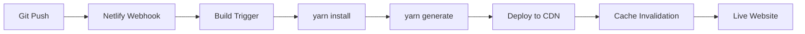
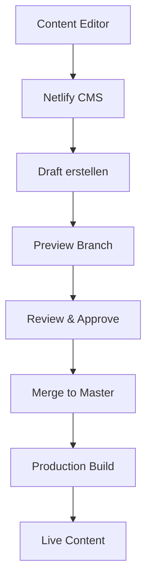
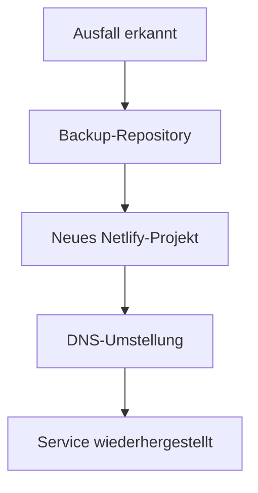

# Deployment & Hosting - The Yelling Light

## Hosting-Plattform: Netlify

### Deployment-Konfiguration
- **Platform**: Netlify
- **Repository**: GitHub (Git-Gateway Integration)
- **Build Command**: `yarn generate`
- **Publish Directory**: `dist/`
- **Node Version**: 16.x (empfohlen)

### Netlify-Konfiguration
```toml
# netlify.toml
[build]
  command = "yarn generate"
  publish = "dist"

[build.environment]
  NODE_VERSION = "16"
  YARN_VERSION = "1.22.19"

[[redirects]]
  from = "/*"
  to = "/index.html"
  status = 200

[[headers]]
  for = "/*"
  [headers.values]
    X-Frame-Options = "DENY"
    X-XSS-Protection = "1; mode=block"
    X-Content-Type-Options = "nosniff"
    Referrer-Policy = "strict-origin-when-cross-origin"

[[headers]]
  for = "/img/*"
  [headers.values]
    Cache-Control = "public, max-age=31536000, immutable"
```

## Build-Pipeline

### Automatisierte Builds


### Build-Umgebungen
- **Production**: `master` Branch → `theyellinglight.ch`
- **Preview**: Feature Branches → Deploy Previews
- **Development**: Lokale Entwicklung → `localhost:3000`

### Build-Optimierungen
```javascript
// nuxt.config.js - Production Settings
export default {
  target: 'static',
  ssr: false,
  
  generate: {
    fallback: true,
    crawler: true,
    routes: async () => {
      // Dynamische Routen für alle Content-Typen
      const { $content } = require('@nuxt/content')
      
      const artists = await $content('artists').fetch()
      const albums = await $content('albums').fetch()
      const blog = await $content('blog').fetch()
      const photos = await $content('photos').fetch()
      
      return [
        ...artists.map(artist => `/artists/${artist.slug}`),
        ...albums.map(album => `/releases/${album.slug}`),
        ...blog.map(post => `/news/${post.slug}`),
        ...photos.map(photo => `/photography/${photo.slug}`)
      ]
    }
  },
  
  // Performance Optimierungen
  build: {
    extractCSS: true,
    optimization: {
      splitChunks: {
        cacheGroups: {
          styles: {
            name: 'styles',
            test: /\.(css|vue)$/,
            chunks: 'all',
            enforce: true
          }
        }
      }
    }
  }
}
```

## Content Management Deployment

### Netlify CMS Setup
```yaml
# static/admin/config.yml
backend:
  name: git-gateway
  branch: master

# Netlify Identity für Authentifizierung
publish_mode: editorial_workflow
media_folder: static/img
public_folder: /img

# Preview-URLs für Content-Editoren
collections:
  - name: blog
    preview_path: /news/{{slug}}
  - name: artists
    preview_path: /artists/{{slug}}
```

### Content-Workflow


## Domain & DNS

### Domain-Konfiguration
- **Primary Domain**: `theyellinglight.ch`
- **SSL**: Automatisch via Let's Encrypt
- **CDN**: Netlify Global CDN
- **DNS**: Netlify DNS oder externes DNS

### DNS-Einstellungen
```
# DNS Records
A     @     104.198.14.52
CNAME www   theyellinglight.netlify.app
```

## Environment Variables

### Production Environment
```bash
# Netlify Environment Variables
NODE_ENV=production
NUXT_ENV_BASE_URL=https://theyellinglight.ch
NUXT_ENV_CMS_URL=https://theyellinglight.ch/admin
GOOGLE_ANALYTICS_ID=GA-XXXXXXXXX
```

### Development Environment
```bash
# .env.local
NODE_ENV=development
NUXT_ENV_BASE_URL=http://localhost:3000
NUXT_ENV_CMS_URL=http://localhost:3000/admin
```

## Performance Monitoring

### Core Web Vitals
- **LCP (Largest Contentful Paint)**: < 2.5s
- **FID (First Input Delay)**: < 100ms
- **CLS (Cumulative Layout Shift)**: < 0.1

### Monitoring Tools
```javascript
// plugins/performance.js
export default ({ app }) => {
  if (process.client && process.env.NODE_ENV === 'production') {
    // Web Vitals Tracking
    import('web-vitals').then(({ getCLS, getFID, getFCP, getLCP, getTTFB }) => {
      const sendToAnalytics = (metric) => {
        gtag('event', metric.name, {
          event_category: 'Web Vitals',
          event_label: metric.id,
          value: Math.round(metric.name === 'CLS' ? metric.value * 1000 : metric.value),
          non_interaction: true
        })
      }
      
      getCLS(sendToAnalytics)
      getFID(sendToAnalytics)
      getFCP(sendToAnalytics)
      getLCP(sendToAnalytics)
      getTTFB(sendToAnalytics)
    })
  }
}
```

## Security & Compliance

### Security Headers
```javascript
// nuxt.config.js
export default {
  render: {
    csp: {
      hashAlgorithm: 'sha256',
      policies: {
        'default-src': ["'self'"],
        'img-src': ["'self'", 'data:', 'https:'],
        'style-src': ["'self'", "'unsafe-inline'"],
        'script-src': ["'self'"],
        'object-src': ["'none'"],
        'base-uri': ["'self'"],
        'frame-ancestors': ["'none'"]
      }
    }
  }
}
```

### GDPR Compliance
- Cookie-Consent-Management
- Datenschutzerklärung
- Analytics Opt-out
- Kontaktformular-Verschlüsselung

## Backup & Recovery

### Git-basierte Backups
- **Content**: Automatisch via Git-History
- **Media**: Netlify Large Media oder Git LFS
- **Konfiguration**: Versionskontrolle in Repository

### Disaster Recovery


## Deployment-Checkliste

### Pre-Deployment
- [ ] Code-Review abgeschlossen
- [ ] Tests erfolgreich
- [ ] Performance-Audit durchgeführt
- [ ] Security-Scan bestanden
- [ ] Content-Migration getestet

### Deployment
- [ ] Build erfolgreich
- [ ] Deploy Preview getestet
- [ ] DNS-Propagation überprüft
- [ ] SSL-Zertifikat aktiv
- [ ] CDN-Cache geleert

### Post-Deployment
- [ ] Funktionalitätstests
- [ ] Performance-Monitoring
- [ ] Error-Tracking aktiv
- [ ] Analytics funktionsfähig
- [ ] Backup-Verifikation

## Troubleshooting

### Häufige Build-Probleme
```bash
# Node Version Mismatch
Error: Node version 14.x required
Solution: Update .nvmrc oder Netlify Node Version

# Dependency Issues
Error: Module not found
Solution: yarn install --frozen-lockfile

# Memory Issues
Error: JavaScript heap out of memory
Solution: NODE_OPTIONS="--max-old-space-size=4096"
```

### Performance-Probleme
```javascript
// Bundle-Analyse
yarn build --analyze

// Lighthouse CI
npm install -g @lhci/cli
lhci autorun
```

### Content-Probleme
```yaml
# CMS-Konfiguration validieren
netlify-cms-proxy-server

# Content-Schema prüfen
yarn content:validate
```

## Monitoring & Alerts

### Uptime Monitoring
- **Service**: Netlify Analytics + externes Monitoring
- **Alerts**: E-Mail/Slack bei Ausfällen
- **SLA**: 99.9% Uptime-Ziel

### Performance Alerts
```javascript
// Performance Budget
const performanceBudget = {
  LCP: 2500,
  FID: 100,
  CLS: 0.1,
  bundleSize: 250000 // 250KB
}

// Alert bei Überschreitung
if (metric.value > performanceBudget[metric.name]) {
  sendAlert(`Performance budget exceeded: ${metric.name}`)
}
```

## Skalierung & Optimierung

### CDN-Optimierung
- **Gzip/Brotli**: Automatisch via Netlify
- **Image Optimization**: Netlify Image CDN
- **Cache-Strategien**: Statische Assets mit langen Cache-Zeiten

### Database-freie Architektur
- **Vorteile**: Keine Datenbankwartung, bessere Performance
- **Content**: Git-basiert, versioniert
- **Suche**: Client-side oder Algolia Integration

### Internationale Expansion
```javascript
// i18n-Vorbereitung
export default {
  i18n: {
    locales: ['de', 'en', 'fr'],
    defaultLocale: 'de',
    strategy: 'prefix_except_default'
  }
}
```

## Kosten-Optimierung

### Netlify-Limits
- **Bandwidth**: 100GB/Monat (Free Tier)
- **Build Minutes**: 300 Minuten/Monat
- **Forms**: 100 Submissions/Monat
- **Functions**: 125.000 Requests/Monat

### Optimierungsstrategien
- Bildkomprimierung vor Upload
- Lazy Loading für alle Medien
- Bundle-Splitting für bessere Caching
- Statische Generierung statt SSR