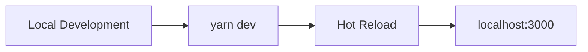
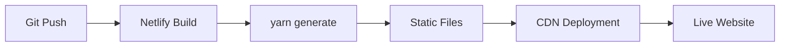

# Technische Architektur - The Yelling Light

## Framework & Technologie-Stack

### Frontend Framework
- **Nuxt.js 2.14.5**: Vue.js-basiertes Meta-Framework
- **Vue.js**: Reaktive UI-Komponenten
- **@nuxtjs/composition-api**: Composition API Support für Vue 2

### Styling & UI
- **Tailwind CSS 3.0.2**: Utility-First CSS Framework
- **GSAP 3.6.0**: Animationsbibliothek für komplexe Animationen
- **Vue-SVGIcon 3.2.9**: SVG-Icon-System
- **Custom CSS**: Zusätzliche Styles in `assets/styles/`

### Content Management
- **@nuxt/content 1.8.1**: Markdown-basiertes CMS
- **Netlify CMS**: Git-basiertes Headless CMS
- **remark-breaks 3.0.1**: Markdown-Verarbeitung mit Zeilenumbrüchen

### Performance & Optimierung
- **vue-lazyload 1.3.3**: Lazy Loading für Bilder
- **Core.js 3.6.5**: JavaScript Polyfills
- **Nuxt Generate**: Statische Site-Generierung

### Multimedia & Interaktivität
- **PIXI.js 6.0.2**: 2D WebGL-Rendering
- **pixi-filters 4.1.0**: Visuelle Effekte und Filter
- **vue-multiselect 2.1.6**: Erweiterte Select-Komponenten

## Architektur-Diagramm

```mermaid
graph TB
    subgraph "Frontend Layer"
        A[Nuxt.js App] --> B[Vue Components]
        B --> C[Pages]
        B --> D[Layouts]
        B --> E[Components]
    end
    
    subgraph "Content Layer"
        F[Netlify CMS] --> G[Git Repository]
        G --> H[Markdown Files]
        H --> I[@nuxt/content]
        I --> A
    end
    
    subgraph "Styling Layer"
        J[Tailwind CSS] --> B
        K[GSAP Animations] --> B
        L[Custom CSS] --> B
        M[SVG Icons] --> B
    end
    
    subgraph "Build & Deploy"
        A --> N[Nuxt Generate]
        N --> O[Static Files]
        O --> P[Netlify CDN]
    end
    
    subgraph "External Services"
        Q[Spotify API] --> A
        R[YouTube API] --> A
        S[Social Media] --> A
    end
```

## Verzeichnisstruktur

### Core Directories
```
├── assets/              # Build-Assets (CSS, Icons)
│   ├── icons/           # SVG-Icons (Quell-Dateien)
│   └── styles/          # CSS-Dateien
├── components/          # Vue-Komponenten
├── content/             # Markdown-Content
├── helpers/             # Utility-Funktionen
├── icons/               # Generierte Icon-Komponenten
├── layouts/             # Nuxt-Layouts
├── pages/               # Nuxt-Seiten (Auto-Routing)
├── plugins/             # Nuxt-Plugins
├── static/              # Statische Assets
└── store/               # Vuex Store (falls verwendet)
```

### Konfigurationsdateien
- **nuxt.config.js**: Haupt-Nuxt-Konfiguration
- **tailwind.config.js**: Tailwind CSS Konfiguration
- **jsconfig.json**: JavaScript-Projekt-Konfiguration
- **.eslintrc.js**: ESLint-Regeln
- **.prettierrc**: Code-Formatierung

## Komponenten-Architektur

### Core Components
- **Header.vue**: Hauptnavigation
- **Footer.vue**: Footer mit Links
- **Nav.vue**: Navigationskomponente
- **Card.vue**: Wiederverwendbare Kartenkomponente
- **BackgroundImage.vue**: Optimierte Hintergrundbilder

### Specialized Components
- **spotifyEmbed.vue**: Spotify-Player-Integration
- **youtubeEmbed.vue**: YouTube-Video-Integration
- **socialBar.vue**: Social Media Links
- **mailchimpForm.vue**: Newsletter-Anmeldung
- **lazyLoad.vue**: Lazy Loading Wrapper

### Utility Components
- **Cookie.vue**: Cookie-Consent-Management

## Routing & Navigation

### Auto-Generated Routes
```
/                        # pages/index.vue
/artists                 # pages/artists/index.vue
/artists/:slug           # pages/artists/_slug.vue
/releases                # pages/releases/index.vue
/releases/:slug          # pages/releases/_slug.vue
/news                    # pages/news/index.vue
/news/:slug              # pages/news/_slug.vue
/photography             # pages/photography/index.vue
/photography/:slug       # pages/photography/_slug.vue
/team                    # pages/team.vue
/disclaimer              # pages/disclaimer.vue
```

### Dynamic Content Loading
```mermaid
graph LR
    A[Page Component] --> B[@nuxt/content]
    B --> C[Markdown Query]
    C --> D[Content Processing]
    D --> E[Vue Template]
    E --> F[Rendered Page]
```

## Build & Deployment Pipeline

### Development Workflow


### Production Deployment


### Build Commands
- **Development**: `yarn dev` (Hot reload auf localhost:3000)
- **Production Build**: `yarn build` (SSR-Build)
- **Static Generation**: `yarn generate` (JAMstack-Build)
- **Linting**: `yarn lint` (Code-Qualität)

## Performance-Optimierungen

### Lazy Loading
- Bilder werden erst bei Bedarf geladen
- Komponenten-basiertes Lazy Loading
- Intersection Observer API

### Static Generation
- Alle Seiten werden zur Build-Zeit generiert
- Optimale Performance durch CDN-Caching
- SEO-freundliche statische HTML-Dateien

### Asset Optimization
- SVG-Icons als Vue-Komponenten
- Tailwind CSS Purging für minimale Bundle-Größe
- Automatische Bildoptimierung durch Netlify

## Integration Points

### Content Management
- **Netlify CMS**: Web-Interface für Content-Bearbeitung
- **Git-Gateway**: Authentifizierung und Versionskontrolle
- **Markdown Processing**: Automatische HTML-Konvertierung

### External APIs
- **Spotify Web API**: Album/Artist-Embeds
- **YouTube API**: Video-Embeds
- **Social Media APIs**: Link-Validierung

### Analytics & Monitoring
- **Google Analytics**: Über @nuxtjs/google-analytics
- **Netlify Analytics**: Build- und Performance-Monitoring

## Sicherheit & Best Practices

### Content Security
- Git-basierte Versionskontrolle
- Netlify Identity für CMS-Zugang
- Automatische Backups durch Git-History

### Code Quality
- ESLint für JavaScript-Standards
- Prettier für konsistente Formatierung
- Vue.js Best Practices

### Performance Monitoring
- Lighthouse-Scores regelmäßig prüfen
- Core Web Vitals optimieren
- Bundle-Größe überwachen

## Wartung & Updates

### Dependency Management
- Regelmäßige Updates der npm-Pakete
- Sicherheitsupdates priorisieren
- Breaking Changes dokumentieren

### Content Maintenance
- Regelmäßige Content-Audits
- Broken Link Checks
- Image Optimization Reviews